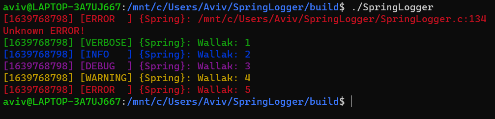

# SpringLogger
Simple C Logger using ANSI colors

##Example
You can see main.c for example code, but here are some functions:
```c
FILE* io = //File to write into, can use stdin;
struct SpringLogger_Settings_t settings = {
        .time //Function returning current time as const char*, for logging
        .level //Min logging level to print, lower level would be ignored
        .colors //If equals to 0 ansi colors won't be used
        .flush //Whether the logger should flush after each line logged
};
SpringLogger_Init(io,&settings);
const char* TAG = //Tag to print in each log line
const char* format = //C style string format
SpringLogger_LOG[V/I/D/W/E](TAG,format,var_args...);
int level = //Log level for line: SPRING_LOGGER_LOG_LEVEL_X
const char* message = //Message to show in location log
SpringLogger_LOG_Location(level,TAG,message);
```

main.c output in WSL Terminal:
